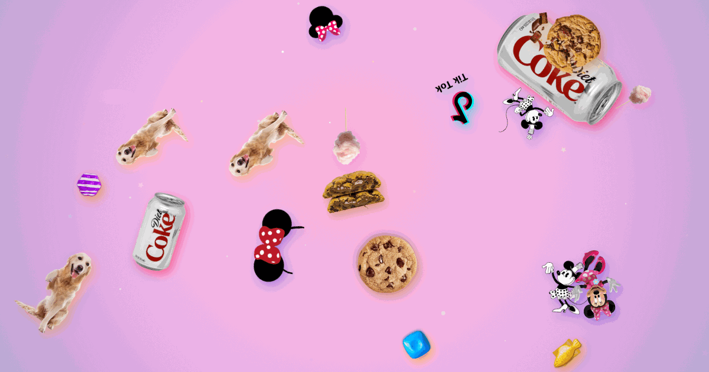

# For Cindy ♥

A little pink sky full of Cindy's favorite things — alive, interactive, and full of secrets.



**Live:** [cindy.coreyschuman.com](https://cindy.coreyschuman.com) (the full sky) ·
[cindy.coreyschuman.com/gift](https://cindy.coreyschuman.com/gift/) (the gift page — device previews + downloads)

Everything drifts, pulses, and bounces. Tap Minnie and it rains bows. Tap a cookie. Press `?` for
the full secrets card. A tiny cottage visits if you're patient.

## What ships

| Piece | Where |
|---|---|
| Interactive page (canvas, zero deps) | `web/index.html` |
| Gift page (device mockups + per-device downloads) | `web/gift/index.html` |
| Wallpapers (1080p/1440p/4K/iPhone) | `web/downloads/` |
| 20-still pack for Windows' built-in Photos screensaver | `web/downloads/stills-screensaver.zip` |
| Native Windows screensaver (Rust, winit + softbuffer) | `scr/` → `web/downloads/CindyDrift.scr` |
| Seamless 15s video loops (desktop + phone) | `web/downloads/*.mp4` |

## How it works

The scene is fully deterministic: a `mulberry32` seeded PRNG, no `Math.random`. The same page
renders headlessly via `index.html?render=WxH&seed=N&t=SEC` with fixed 1/30s steps — that's how
every wallpaper, still, and video frame is produced, and why re-renders are byte-stable. Live-only
features (bursts, cottage timer, collisions, disco) are gated off in render mode.

The `.scr` is the same scene reimplemented in Rust. It embeds the sprite PNGs from `web/assets/`
via `include_bytes!`, mirrors the category manifest at the top of `web/index.html` (same variants,
weights, and scales), and cross-compiles from macOS with `x86_64-pc-windows-gnu`.

To add or retire art, edit the manifest block at the top of `web/index.html` and drop the PNG into
`web/assets/` — the live page picks it up on the next load. `assets/SOURCES.md` tracks where each
sprite came from.

## Dev

```bash
# Render pipeline (Playwright; serves web/ itself)
cd tools && npm ci
node make_wallpapers_fixed.js         # wallpapers → dist/wallpapers/
node make_stills.js                   # stills pack → dist/stills/
node make_video_frames_480.js 1920 1080 ../dist/_frames   # video frames…
bash build_seamless.sh ../dist/_frames ../dist/loop.mp4   # …→ seamless loop

# Rust screensaver
cd scr && cargo test
cargo build --release --target x86_64-pc-windows-gnu

# Determinism must hold over http, not file:// (canvas export taints otherwise)
python3 -m http.server 8765 -d web
```

`dist/` is regenerable build output and is not tracked; finished artifacts are committed to
`web/downloads/` so GitHub Pages serves them.

## Deploy

GitHub Pages serves the `gh-pages` branch, regenerated from `web/` on every deploy:

```bash
git push origin main && git branch -D gh-pages; git subtree split --prefix web -b gh-pages && git push -f origin gh-pages
```

`web/CNAME` pins the custom domain and must survive regeneration (it lives in `web/`, so it does).

---

Personal gift project. Sprite imagery belongs to its respective owners; see `assets/SOURCES.md`.
